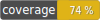

<h1>phpunit matrix data provider</h1>

        

Apie is a suite of composer packages to work with domain objects. It tries to aim to follow a Domain-objects-first approach and not a database first approach that you find in many PHP frameworks nowadays.

TODO documentation

This package can create data providers with help of an object factory and the (typed) method arguments of the test case. It can also be used outside PHPUnit for example for seeding data etc.
